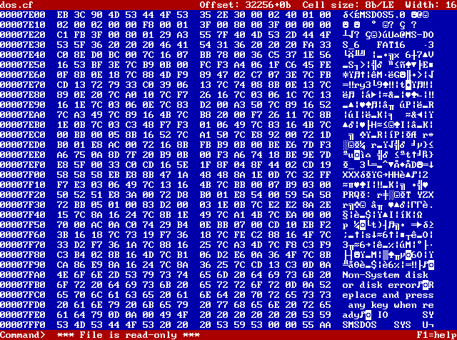
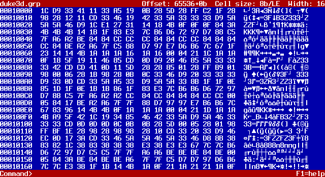
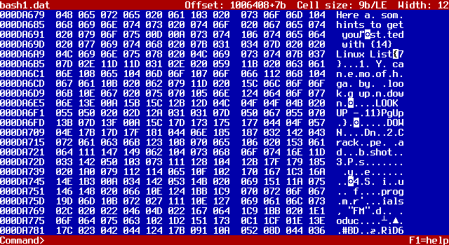

Linux List
----------
A Linux clone of Vernon D. Buerg's List file viewer  
Copyright 2009-2016 Adam Nielsen <malvineous@shikadi.net>  
https://github.com/Malvineous/linuxlist

This program is still very early in development, so there is still much to
implement before it becomes as useful as the original List.

Features:

 * Hex viewer, with full 8-bit CP437 glyphs (UTF8 console required), so that
   binary files look like they did under DOS.

 * Adjustable byte size.  Viewing data as nine-bits per "byte" helps
   considerably when examining LZW-compressed data.  Both big and little
   endian splitting is supported.

 * Hex view supports hex editing (via byte values and direct text entry)

 * Can seek at the byte level or the bit level, which is useful for tracing
   algorithms that operate on a stream of bits rather than on bytes.

The utility is compiled and installed in the usual way:

    ./autogen.sh          # Only if compiling from git
    ./configure && make
    sudo make install

You will need the following prerequisites already installed:

  * [libgamecommon](https://github.com/Malvineous/libgamecommon) >= 2.0

This program is released under the GPLv3 license.

### Screenshots ###

This is the hex view in Xorg, using the VGA font borrowed from DOSBox:



This is the hex view using the rxvt-unicode terminal emulator with the Terminus
font:



This is the hex view showing nine bits per byte, which reveals ASCII characters
in some LZW-compressed data.  Note the data is being edited in this mode as
well:



### Fonts ###

When running in a terminal emulator (automatic if the `DISPLAY` environment
variable is empty), use of a Unicode font that supports CP437 glyphs is
recommended.  Without this, most terminal emulators will pull the glyphs from a
fallback font, which usually looks quite bad.

For the rxvt-unicode terminal and the Terminus font (used for the screenshots
above), this is done by ensuring the ISO10646 encoding is used.  This can be
done by adding the following to `~/.Xresources`:

```
Rxvt*font:                -*-terminus-bold-r-*-*-*-140-*-*-*-*-iso10646-*
Rxvt*boldFont:            -*-terminus-bold-r-*-*-*-140-*-*-*-*-iso10646-*
```

Run `xrdb -merge ~/.Xresources` to reload the file, then any new rxvt-unicode
terminal windows will correctly display control characters.
